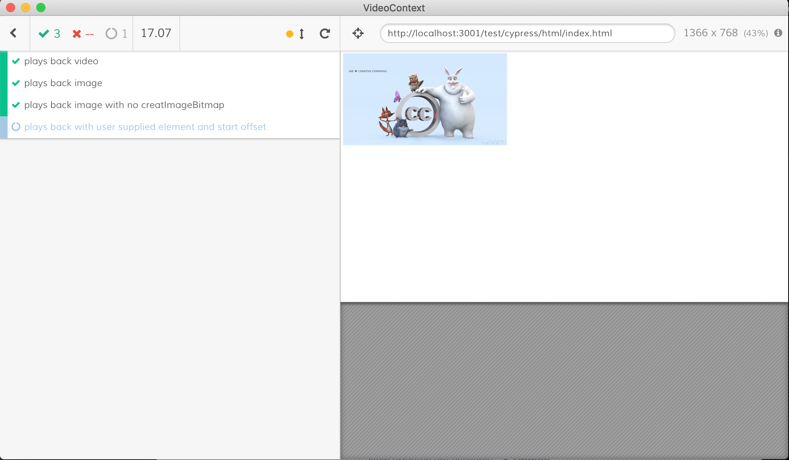

# Cypress testing

## Quick links

- updating snapshots
- creating a test
- debugging a failing test


## Why Cypress

Cypress enables us to

- open a browser during development to visibly see failing tests
- produce pixel diffs of the `VideoContext` canvas before and after changes to code 
- run headless browser testing as part of our Travis CI



<p align="center"><em>The Cypress GUI</em></p>


<p align="center"><em>A failing image diff</em></p>


## Structure 

#### [html/index.html](./html/index.html)

The very simple html fixture we use for all tests. This is pretty much just a `canvas`
element and some js to help inject `VideoContext` into our test code.

#### [assets/](./assets)

A few video and image files used in the tests.

#### [support/commands.js](./support/commands.js)

Where we register our custom test commands and configure the third party `matchImageSnapshot`
command.

#### [integration/*.spec.js](./integration)

The spec files containing the test code.


## Running the tests

```
# serve the test html page and open the Cypress GUI
yarn cypress

# or if you want to simulate what CI does (run in headless mode)
yarn ci:cypress
```
